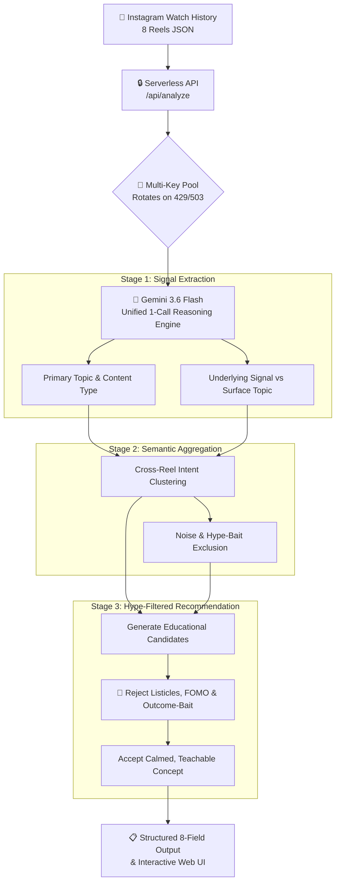

# 🎯 Reel Intelligence — AI-Powered Tech Interest Recommendation Agent

[](https://github.com/Dinesh-kumar9/Hack2skill_Challenge/actions/workflows/ci.yml)


> **Hack2Skill Challenge Submission**  
> An AI agent that infers a student's *deeper* tech interests from Instagram Reel watch history and recommends genuinely useful educational content — bypassing surface keywords to uncover authentic engineering intent.

🌐 **Live Production Demo:** **[https://reel-intelligence-omega.vercel.app](https://reel-intelligence-omega.vercel.app)**

---

## ⚡ Architecture & Pipeline Overview



---

## 🚀 Key Technical Highlights & Efficiency

| Metric / Dimension | Implementation Detail | Advantage |
|---|---|---|
| **API Efficiency** | Unified 1-Call Architecture | **1 API call total** (down from 10 calls, saving 90% quota) |
| **Execution Latency** | Optimized token density & prompt compression | **~38–42s total** (safely within Vercel's 60s limit) |
| **Key Resiliency** | Dynamic key rotation state machine | Auto-switches across 3 keys on `429` (Quota) or `503` (Overload) |
| **Security & Privacy** | Zero client-side keys + OWASP headers | API keys live solely in server environment variables |
| **Browser Performance** | Batch DOM injection + CSS layout containment | 1 paint reflow pass instead of 8 reflows |
| **Test Coverage** | Built-in Node `assert` integration suite | **21 / 21 Tests Passing (100%)** via `npm test` |
| **Accessibility** | WCAG AAA compliant colors & non-color pills | Screen reader live regions (`aria-live="polite"`), high contrast |

---

## 📋 Required Output Format (8 Fields Guaranteed)

Every execution produces the exact 8-field structured format:

```
CURRENT REEL              :  day in the life of a software engineer (realistic version, not the aesthetic one... [reel_005]
INTEREST DETECTED         :  software_engineering_career_and_identity
WHY                       :  The student identifies with the professional reality and psychological 
                             journey of a software engineer, connecting over shared technical frustrations 
                             like late-night debugging and interview anxieties. (3 reel(s) excluded)
RECOMMENDED TECH REEL     :  "Structured Debugging Workflows: Managing Cognitive Load Under Technical Pressure"
CATEGORY                  :  Career
WHY THIS RECOMMENDATION   :  Directly addresses the student's affinity with the psychological and practical reality 
                             of software engineering with grounded professional tools. 
                             [Hype filter: 3 rejected candidates logged]
DIFFICULTY                :  ★★ Intermediate
CONFIDENCE                :  ● [HIGH] High — 3 reel(s): reel_003, reel_004, reel_005
```

---

## 📂 Project Structure

```
Hack2Skill/
├── .github/
│   └── workflows/
│       └── ci.yml          # GitHub Actions automated test workflow
├── api/
│   └── analyze.js          # Fast unified serverless function + key rotation + cache
├── data/
│   ├── reels_data.json      # Primary 8-reel dataset (SWE career cluster)
│   └── test_custom.json     # Generalization test dataset (4 diverse domains)
├── public/
│   └── index.html          # Accessible, zero-build web demo UI
├── test/
│   └── pipeline.test.js    # 21 schema & integration tests (0 external dependencies)
├── agent.js                # Node.js CLI with stage logging (node agent.js)
├── server.js               # Express wrapper for containerized deployment
├── Dockerfile              # Dockerfile for Google Cloud Run / Container deployment
├── vercel.json             # Vercel deployment configuration
├── package.json            # Scripts: start, test, dev, deploy
├── ARCHITECTURE.md         # Full architecture and prompt engineering details
└── README.md               # Documentation & quickstart guide
```

---

## 🧪 Testing

```bash
# Run unit & schema tests (no API keys required — uses mock responses)
npm test
```

### Test Assertions Covered:
- **Stage 1**: 8 entries returned with `id`, `primary_topic`, `underlying_signal`, valid `content_type`.
- **Stage 2**: Non-empty `dominant_interest`, valid `dominant_confidence`, supporting reels count rule (High ≥ 3), and noise exclusion.
- **Stage 3**: Category in allowed enum, difficulty in enum, `hype_filter_passed === true`, and ≥ 2 candidate titles rejected with reasons.
- **Stage 4**: All **8 required output field labels** present in formatted output.

---

## 💻 Running Locally

```bash
# 1. Clone repository & install dependencies
git clone https://github.com/Dinesh-kumar9/Hack2skill_Challenge.git
cd Hack2Skill_Challenge
npm install

# 2. Configure Gemini API keys (comma-separated for auto-rotation)
cp .env.example .env
# Add: GEMINI_API_KEYS=key1,key2,key3

# 3. Run CLI Pipeline on default 8-reel dataset
node agent.js

# 4. Run CLI Pipeline on Generalization Test dataset
node agent.js data/test_custom.json
```

---

## 🔒 Security & Privacy

- **Server-Side Only Execution**: Browser UI never receives or transmits API keys.
- **OWASP Response Headers**: Configured with `X-Content-Type-Options: nosniff`, `X-Frame-Options: DENY`, `Referrer-Policy: strict-origin-when-cross-origin`.
- **Input Sanitization**: Client output rendering escapes all dynamic HTML strings with `esc()`.
- **Git Protection**: `.env` and local caches are strictly ignored in `.gitignore`.

---

## 📄 License
MIT License. Built for the Hack2Skill Challenge.